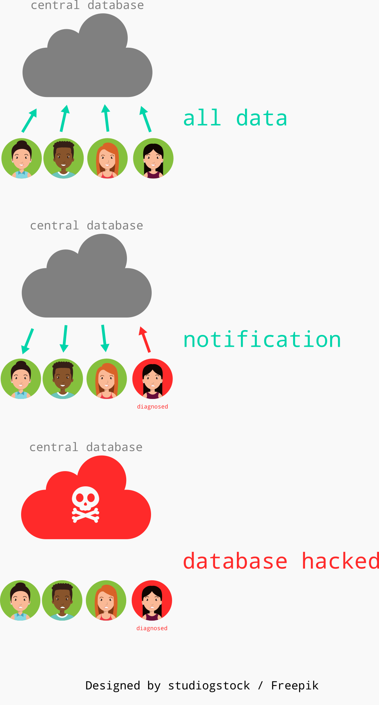
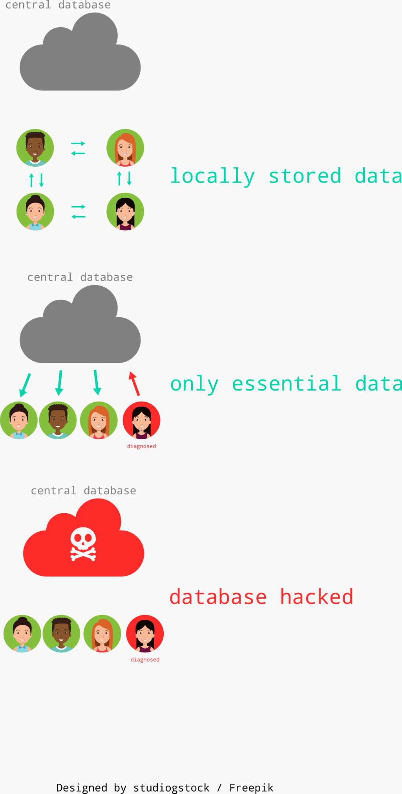

DTrack
---

An open-source, distributed, privacy-first app for making COVID-19
tracking easier.

Overview
---
This app is an attempt to tackle one aspect of the COVID-19 issue,
i.e. tracing diagnosed people and their contacts. As noble as the
intention be, there are serious privacy issues, if not done properly,
which threaten to outweight any potential benefit of this app. Thus,
our principles for the app are - 

1. **Privacy** - data is stored locally, encrypted and in the control
of the user
2. **Distributed** - no central body should have access to all the data
3. **Open-source** - it should be possible for anyone to audit the app
4. **Safety** - only the bare minimum data required is shared, with proper
data-deletion and revocation policies

The 2 parts of this app are the mobile app and the backend server -
* [Mobile App](https://github.com/anmolsahoo25/covid19-dtrack-app)
* [Web Server](https://github.com/anmolsahoo25/covid19-dtrack-api)

<small>The terms are used loosely here to define intent. Every effort
will be made to adhere to the aims, but short of a formal-proof, 
guarantees will not be made</small>

The approach
---
Traditional apps will send all user data to a central storage and compute
cases and incidences on the centralized server itself. 

But this has a lot of problems,

1. The central database is storing a lot of data it does not need.
In the event of a data-breach, a lot of this information is exposed.
2. The users do not control their data once they hand it over, it
can be used for any other purpose. 

A better approach would be to store the data locally. Only the bare
minimum required information is sent to a central database to inform
the other users.

How does it work
---
After having discussed the big picture, let's have a look at how the 
app works,

* The front-end mobile app stores necessary information for all
users locally, such as
  + Bluetooth devices seen
  + Wifi routers seen
  + GPS history
* Once a person is diagnosed, a certified authority uploads the
information to a central database for others to download
* The other users regularly update this database and cross-verify
if they have been in the vicinity of the suspected cases

The app does not collect or publish any personally identifiable
information for normal users. Upon diagnosis of a person, we push all
the devices seen by the diagnosed person, for other users to verify.
Even with this information, it should be difficult to identify the
user, without significant effort.

Advanced features
---
Here are some key-points, that we are considering to further enhance
the features of this app - 
1. End-to-end encryption - Data is end-to-end encrypted to ensure that
malicious parties can't decipher the data even if compromised
2. Differential privacy - Add random noise to aggregate stats to throw
off identification efforts
3. Revocation policies - Use keys supplied by diagnosed people to lock
their data and revoke permissions if they choose so
